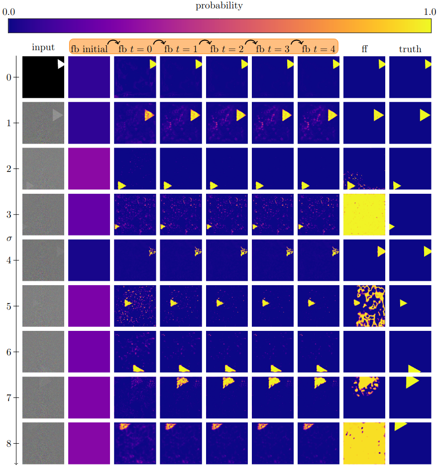
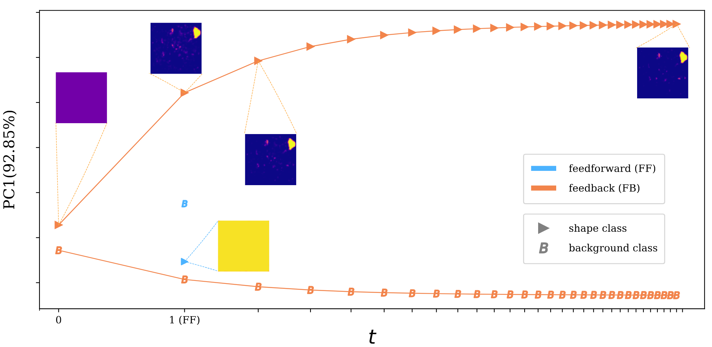

# Feedback in Segmentation

This is the github repository referent to the paper [Deep Recurrence for Dynamical Segmentation Models](https://arxiv.org/abs/2507.10143), which proposes feedback of high level layer representations to the input. This is done by concatenating this representation with the input, modifying the ```in_channels``` of your model, and regularizing the neural network activity to decay over time. If you're having trouble running the code, please open an issue.

Check in the figure below, how noise impacts a feedback model and a feedforward model.


We also show that the model is stable.


Please check the ```examples``` folder for python example scripts.

## Setup

Please create an environment before using this code, because it requires specific versions of ```torch``` and ```torchvision```. This can be done with anaconda as:
```bash
conda create -n <envname> python=3.10
conda activate <envname>
```

Install this package via pip:
```bash
pip install git+https://github.com/DCalhas/feedback_segmentation.git
```

Alternatively, if you want to manually install the requirements, please setup an environment with the following requirements:

| Python package | Version |
|:---------------|:-------:|
| **torch**		 | 2.1.0|
| **skimage** 	 | 0.23.2 |
| **cv2**		 | 4.9.0.80 |
| **numpy**		 | 1.24.4 |
| **torchvision**| 0.16.0 |
| **PIL**		 | 10.2.0 |
| **segmentation_models_pytorch** | 0.2.0 |
| **six** | 1.16.0 |

## How to use

After installing the package either via pip or manually, you can start using the code. An example is:
```python
import feedback_segmentation as fbs

import torch

## State the number of classes you want, the resolution of the images
n_classes=2
resolution=(512,512)
noise=10.0
n_samples=10
device=cuda:0
epochs=10

# Create a dataset
dataset=fbs.data.PolygonsDataset(n_samples,classes=n_classes-1,noise=noise,resolution=resolution)
dataset.sample()

# Create the model
x,_=dataset.__getitem__(0)
model=fbs.layers.NeumannFeedback.build_unet(x.shape[0], n_classes, x.shape[1:], **fbs.layers.NeumannFeedback.UNetParams)

# Train the model
loss_fn=torch.nn.CrossEntropyLoss()
optimizer = torch.optim.Adam(model.parameters(), lr=0.01)
train_dataset_loader=torch.utils.data.DataLoader(dataset, batch_size=1, shuffle=True)
model.to(device)
for epoch in range(epochs):
	model.train()
	for batch in train_dataset_loader:
		imgs = batch[0]
		true_masks = batch[1]
		imgs = imgs.to(device=device,)
		true_masks = true_masks.to(device=device,)
		#the forward call of the NeumannFeedback model performs backward operations
		optimizer.zero_grad()
		model.ground_truth=true_masks
		loss=loss_fn(model(imgs, T=5), true_masks)
		loss.backward()
		optimizer.step()
		epoch_loss += loss.item()
		n_batches+=1
		print("Loss "+str(loss.item()), end="\r")
	print("Epoch "+str(epoch+1)+" with loss "+str(epoch_loss/n_batches), end="\n")


# Evaluate the model in a different dataset
with torch.no_grad():
	test_dataset=fbs.data.PolygonsDataset(200,classes=n_classes-1,noise=noise,resolution=resolution)
	test_dataset.sample()
	test_dataset_loader=train_dataset_loader=torch.utils.data.DataLoader(test_dataset, batch_size=1, shuffle=True)
	print(fbs.metrics.IoU(test_dataset_loader, model, T=10, device=device))

```

## Citation

If you found this repository useful and used it in your research, please do not forget to cite it as:
```
@article{calhas2025,
  title={Deep Recurrence for Dynamical Segmentation Models},
  author={Calhas, David and Oliveira, Arlindo L},
  journal={arXiv preprint arXiv:2507.10143},
  year={2025}
}
```
